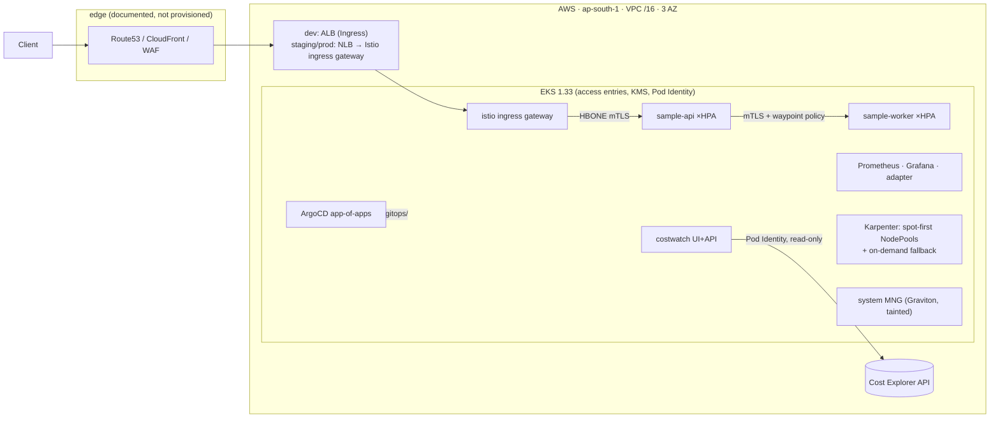

# eksp — a production-grade EKS platform, engineered for millions of requests

Terraform-provisioned Amazon EKS with Karpenter, Istio ambient mesh, ArgoCD
GitOps, full observability, and a real workload: **costwatch**, a FinOps web app
that traces this account's AWS spend hourly→monthly, service→resource.

Design target: **1M requests/minute sustained (~17k RPS), 3× spike absorbed
without manual action** — with the per-layer engineering to back it documented
in [docs/SCALING.md](docs/SCALING.md) and encoded as executable k6 thresholds.

> Built as a Staff DevOps Engineer portfolio project. Every non-obvious decision
> has an [ADR](docs/adr/); the scaling claims are labeled design targets until
> reproduced (`make k6-ramp`) — no invented benchmarks.
> Presenting this in an interview? Start at [docs/INTERVIEW.md](docs/INTERVIEW.md).

## Architecture



- **Terraform owns** anything with IAM coupling or needed before pods schedule:
  VPC, EKS, Karpenter, ALB controller, ArgoCD itself ([ADR-0004](docs/adr/0004-terraform-gitops-boundary.md)).
- **ArgoCD owns** everything else, continuously self-healing from `gitops/`:
  platform baseline, Istio ambient, observability, both apps.
- **Drift is watched at both layers** ([ADR-0016](docs/adr/0016-drift-detection.md)):
  ArgoCD reconciles Kubernetes in near-real-time; a nightly `terraform plan`
  opens a GitHub issue when AWS diverges from state.

## What's demonstrated

| Concern | Implementation |
|---|---|
| Compute at scale | Karpenter 1.13: spot-first + on-demand fallback pools, consolidation budgets, 30d node expiry, conntrack tuning |
| Traffic at scale | ALB/NLB ip-mode targets, RPS-based HPA (prometheus-adapter), NodeLocal DNSCache, prefix delegation, zero-error rolling deploys (in-app drain ↔ deregistration alignment) |
| Zero-trust | Istio **ambient** STRICT mTLS + AuthorizationPolicy + waypoint L7 policy ([ADR-0011](docs/adr/0011-istio-ambient-mesh.md)) |
| GitOps | ArgoCD app-of-apps per env, sync waves, image promotion via CI-opened PRs |
| Observability | kube-prometheus-stack, multiwindow burn-rate SLO alerts, RED dashboard as code |
| FinOps | costwatch (this repo's own app) + honest [COST.md](docs/COST.md) + spot/Graviton strategy |
| Security | OIDC-only CI, Pod Identity, restricted PSS, default-deny NetworkPolicy, KMS secrets, IMDSv2, checkov/tflint/gitleaks |
| IaC quality | Wrapped community modules, `terraform test` with mock providers, S3-native state locking, Renovate |
| AI harness | CLAUDE.md conventions + `.claude/settings.json` guardrails (agents cannot apply/destroy) |

## Quickstart

Prereqs: terraform ≥ 1.10, aws cli (authenticated), kubectl, helm, go, node 22.
`mise install` sets everything up if you use [mise](https://mise.jdx.dev).

```bash
# 0. see every entry point
make help

# 1. one-time per account: state bucket, GitHub OIDC roles, ECR
make bootstrap                       # asks for github_org / github_repo

# 2. dev cluster (~15 min; ~$170/mo while it exists — see docs/COST.md)
make init ENV=dev
make apply ENV=dev
make kubeconfig ENV=dev

# 3. point GitOps at your fork, then re-apply to create the root app
./scripts/configure-repo.sh https://github.com/<you>/<repo>.git \
    "$(aws sts get-caller-identity --query Account --output text).dkr.ecr.ap-south-1.amazonaws.com"
git add -A && git commit -m "chore: personalize repo refs" && git push
make apply ENV=dev                   # with gitops_repo_url set in tfvars

# 4. look around
make argocd-ui                       # sync status of everything
make grafana-ui                      # RED dashboard, SLO alerts
make costwatch-ui                    # your AWS bill, traced

# no AWS account handy? the FinOps app runs on synthetic data:
make costwatch-demo                  # http://localhost:8080
```

Offline verification (what CI runs): `make check` — fmt, tflint, validate ×4
roots, mocked `terraform test`, helm lint, kubeconform on every overlay, and
both apps' unit tests. No cloud credentials needed.

## Repo map

```
terraform/   bootstrap (state+OIDC+ECR) · modules (network, eks-cluster,
             karpenter, addons, gitops-bootstrap) · envs (dev/staging/prod)
gitops/      ArgoCD app-of-apps per env · platform baseline · Istio ambient
             · observability · app overlays
apps/        sample-api (Go, scale demo) · costwatch (Go + React FinOps app)
load/k6/     smoke · ramp-to-17k-RPS · spike · soak (thresholds = SLOs)
docs/        ARCHITECTURE · SCALING · RUNBOOK · COST · SECURITY · INTERVIEW · adr/
```

## Documentation

- [ARCHITECTURE.md](docs/ARCHITECTURE.md) — layers, boundaries, request path, IAM model
- [SCALING.md](docs/SCALING.md) — the millions-of-requests engineering, layer by layer, with math
- [RUNBOOK.md](docs/RUNBOOK.md) — operations: upgrades, drains, drift, incident trees (alerts link here)
- [COST.md](docs/COST.md) — what each env costs and which levers move it
- [SECURITY.md](docs/SECURITY.md) — threat model, controls, hardening backlog
- [INTERVIEW.md](docs/INTERVIEW.md) — how to walk a panel through this repo
- [docs/adr/](docs/adr/) — 17 decision records, including the rejected options

## Roadmap (deliberately not built — see ADRs for why)

Multi-region active/active · private-only API endpoint + VPN · SSO (ArgoCD,
Grafana, costwatch) · CUR 2.0 → Athena deep cost lineage (flag exists) ·
Thanos/Mimir long-term metrics · CloudFront+WAF edge module · Kubecost showback.

## License

[MIT](LICENSE)
