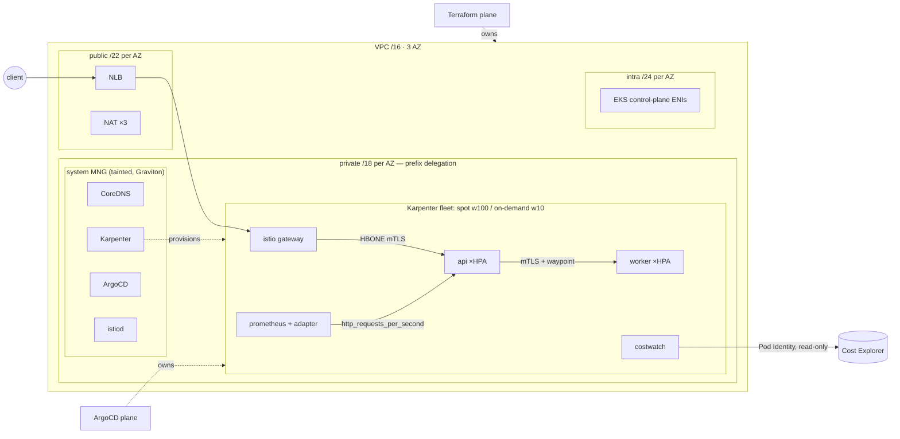

# INTERVIEW — how to walk a panel through this repo

The repo is the evidence; this is the delivery. Staff-level interviews reward
**judgment made visible**: every section below pairs "what I built" with "what
I rejected and why" — that second half is what separates senior from staff.

## The 90-second pitch (memorize the beats, not the words)

> "I built a production-grade EKS platform sized for a million requests a
> minute, and then ran a real product on it — a FinOps dashboard that traces
> the platform's own AWS bill down to the resource. Terraform provisions
> everything IAM-coupled; ArgoCD owns everything in-cluster from git, so drift
> self-heals at the Kubernetes layer and a nightly plan catches it at the AWS
> layer. Compute is Karpenter, spot-first with on-demand fallback on Graviton —
> that's the cost story. Traffic enters through an in-mesh gateway because
> STRICT ambient mTLS rejects plaintext from an out-of-mesh ALB — that's the
> kind of interaction you only hit when you actually build it. Every
> non-obvious decision is an ADR, and the scaling claims are executable k6
> thresholds, not slideware."

Then stop talking and let them pick a thread. Every thread has depth.

## Whiteboard flow (draw in this order)

1. **Box the VPC**: 3 AZ; public /22, private /18, intra /24 — say *why* the
   privates are huge (prefix delegation = pod IPs are the scarce resource).
2. **EKS control plane** in intra; **two compute pools**: tainted system MNG
   ("Karpenter can't manage the capacity it runs on") + Karpenter fleet.
3. **Request path**: client → NLB → Istio gateway → api → (mTLS, waypoint) →
   worker. Mark where TLS terminates and where identity is enforced.
4. **The two control loops** on the side: Terraform→AWS, ArgoCD→cluster, with
   the boundary rule written between them.
5. **Observability rail**: metrics → adapter → HPA (the "scale on RPS, not
   CPU" arrow) and → burn-rate alerts → runbook anchors.

This is the target drawing — practice until reproducing it on a whiteboard
takes four minutes:

**Practice with the editable version:** open
[`diagrams/eksp-whiteboard.excalidraw`](../diagrams/eksp-whiteboard.excalidraw)
at [excalidraw.com](https://excalidraw.com) (File → Open) — movable
hand-drawn-style boxes you can redraw from memory, annotate with failure
points, or screen-share in a virtual interview.
([`eksp-control-loops.excalidraw`](../diagrams/eksp-control-loops.excalidraw)
exists too; PNG/SVG renders sit alongside in [`diagrams/`](../diagrams/).)

## The diagrams (rendered on GitHub — walk them, don't memorize them)

| Diagram | Where | Use it for |
|---|---|---|
| Two control loops + drift | [ARCHITECTURE.md](ARCHITECTURE.md#the-two-plane-model) | "how do you manage drift?" |
| Request path, hop by hop | [ARCHITECTURE.md](ARCHITECTURE.md#request-path) | "walk me through a request" |
| Spike response (HPA × Karpenter) | [SCALING.md](SCALING.md#the-spike-end-to-end) | "what happens when traffic triples?" |
| Zero-error deploy timeline | [SCALING.md](SCALING.md#deploys-at-full-load) | "how do you deploy without 5xx?" |
| Platform overview | [README](../README.md#architecture) | the 30-second orientation |

## Per-layer talking points (build → rejected alternative)

- **Terraform, wrapped community modules** → *rejected hand-rolling*: "battle-
  tested modules + thin opinionated wrappers shows judgment; NIH VPC code shows
  time to waste." *Rejected Terragrunt*: DRY pays at 10+ envs; at 3, indirection
  costs reviewers more than duplication costs maintainers (ADR-0002).
- **Terraform vs Pulumi** (they will ask): "Terraform when the org's center of
  gravity is platform/ops — plan-review culture, module ecosystem, policy
  tooling. Pulumi when platform engineers are SWE-first and need typed
  abstractions or the Automation API. I'd pick Pulumi for building an internal
  platform *product*; Terraform for infrastructure an org must review."
- **Karpenter over Cluster Autoscaler**: bin-packs from pending pods against
  the whole EC2 catalog in seconds vs nudging fixed ASGs; consolidation +
  spot-native interruption handling. *Trade*: a controller with EC2 write
  access in-cluster — mitigated by ceilings + budgets (ADR-0003).
- **Ambient over sidecars**: mesh cost scales with nodes, not pods; no
  injection/restart lifecycle. *Rejected*: Linkerd (licensing shift), Cilium
  mesh (replacing VPC CNI is a bigger blast radius than the feature justifies),
  App Mesh (EOL). Know the ambient caveat: L7 policy needs waypoints — L4-only
  ztunnel is the default posture (ADR-0011).
- **The gateway insight** (tell this story — it's your best one): "My first
  design had ALB targeting pods directly with STRICT mTLS — those are
  incompatible; ztunnel rejects out-of-mesh plaintext. The fix is architectural:
  north-south must enter through an in-mesh gateway. Dev keeps the plain ALB
  deliberately so both patterns are demonstrable." Also the API-gateway cost
  math: managed API Gateway at 43B req/mo ≈ $55k/mo vs a few hundred for
  NLB+Envoy (ADR-0017).
- **RPS-based HPA**: "CPU lags; request rate leads. prometheus-adapter exposes
  `http_requests_per_second`, prod targets 800/pod. The capacity math chain:
  17k RPS ÷ 800 ≈ 22 pods ≈ handful of nodes; 3× spike ≈ 64 pods, Karpenter
  fills in under 90s."
- **Zero-error deploys**: recite the chain — maxUnavailable 0 → SIGTERM →
  readyz fails *but serving continues* → deregistration delay → grace period
  outlasts everything. Bonus detail: distroless has no shell, so the app owns
  its drain instead of a preStop sleep.
- **DNS**: "The classic first casualty at scale." ndots fan-out, conntrack,
  cross-node hops → CoreDNS floors + NodeLocal DNSCache with NOTRACK (prod).
- **FinOps** (costwatch): CE API first (works in any account, zero pipeline)
  vs CUR→Athena as the opt-in deep path (ADR-0014); caching as a *correctness*
  feature ($0.01/call); EKS split cost allocation for pod-level showback as
  the roadmap. And the honest macro point from COST.md: **at this volume,
  egress dominates, not the cluster** — that's why the edge tier matters.

## Kubernetes fundamentals — answered with this repo

Staff loops always probe fundamentals. Generic textbook answers are table
stakes; anchoring each one in something you *built* is what lands. Every
answer below ends in a file you can open.

**"Walk me through what happens when a request hits your cluster."**
Trace the [request-path diagram](ARCHITECTURE.md#request-path) hop by hop:
NLB (L4, ip targets — no NodePort hop, ADR-0006) → gateway Envoy (HTTPRoute:
routing + timeout) → ztunnel HBONE tunnel (mTLS, SPIFFE identity per
ServiceAccount) → pod. East-west adds the waypoint (authz + retry policy).
Close with: "two independent gates — NetworkPolicy at L3/4 by pod selector,
AuthorizationPolicy at L7 by cryptographic identity."

**"What happens when you create a pod / how does scheduling work?"**
API server persists the Deployment → ReplicaSet controller creates Pods →
scheduler filters (taints: my system MNG repels workloads; requests: why every
container sets them) and scores (my topologySpreadConstraints spread across
zones/hosts) → no node fits? Pod goes Pending — and *that's Karpenter's input*:
it bin-packs pending pods against the EC2 catalog and creates NodeClaims
([spike diagram](SCALING.md#the-spike-end-to-end)). Kubelet pulls (through the
ECR VPC endpoint in prod), CNI assigns an IP from a delegated /28 prefix,
probes gate readiness, endpoints propagate.

**"How does Service networking actually work?"**
ClusterIP is iptables DNAT programmed by kube-proxy from EndpointSlices — fine
at my service count; IPVS/eBPF is the >5k-services conversation. But note both
my ingress paths *bypass* it deliberately: the LB targets pod IPs directly
(`ip` mode), and in the mesh, ztunnel routes to backends itself. kube-proxy
mostly serves in-cluster ClusterIP traffic like costwatch's scrapes.

**"How does DNS resolution work in a pod, and how does it fail?"**
resolv.conf points at the kube-dns ClusterIP with `ndots:5` + search paths —
an unqualified name fans out to ~5 queries, UDP, through conntrack, cross-node.
At high RPS that's the classic first casualty. My three defenses, in
`gitops/platform/`: CoreDNS floors + zone spread, **NodeLocal DNSCache** in
prod (link-local cache + NOTRACK interception of the kube-dns IP — kills the
conntrack entry *and* the cross-node hop), and FQDN-with-trailing-context URLs
in app config to skip the search path.

**"Requests vs limits? What would you set?"**
Requests are the scheduling contract (bin-packing truth, HPA denominator,
CFS *shares* under contention). Memory limits yes — memory is incompressible,
OOM beats node-level chaos. **CPU limits no** (ADR-0012): CFS quota throttles
in 100ms windows and adds tail latency exactly at peak. Then the kicker: "the
spike diagram shows why — during Karpenter's 60–90s provisioning window, the
original pods absorb the burst on idle node CPU *because* they're unthrottled."

**"How do you take a node out of service safely?"**
Cordon → drain respects PDBs (mine: absolute `1` in dev — a percentage of 2
replicas rounds to 0 and blocks every drain, a real gotcha — 10% in prod) →
each evicted pod runs the full [termination choreography](SCALING.md#deploys-at-full-load).
Karpenter does exactly this on spot interruption: SQS 2-minute warning →
taint, drain, replace. The RUNBOOK has the drill.

**"What's a controller / reconciliation loop?"** — the theme of the whole
repo: HPA (desired replicas from metrics), Karpenter (desired capacity from
pending pods), ArgoCD (desired cluster from git), Terraform (desired AWS from
HCL, human-clocked), even the drift workflow (desired = state file). Same
shape everywhere: observe → diff → act. Point at the
[two-plane diagram](ARCHITECTURE.md#the-two-plane-model).

**"How does the HPA actually compute replicas?"**
`desired = ceil(current × metric/target)` per metric, take the max across
metrics. Mine runs two: CPU-utilization-of-*request* and
`http_requests_per_second` via prometheus-adapter (custom.metrics API) —
because request rate moves seconds before CPU. Scale-up policy is aggressive
(+100% or +8 pods / 15s, no stabilization), scale-down waits 5 minutes —
asymmetric on purpose: under-capacity costs users, over-capacity costs cents.

## Questions they'll ask, and strong answers

**"What breaks first at 17k RPS?"** — "Nothing in the pod path; the sharp
edges are ALB scale-up lag on a step function, DNS under churn, and conntrack
if keep-alives regress. Each has a specific mitigation in SCALING.md — that
doc is the layer-by-layer answer."

**"Why not multi-region?"** — "Cost and complexity buy nothing until there's a
availability requirement or data-locality driver. The design leaves room:
non-overlapping VPCs, stateless workloads, GitOps that targets N clusters. I'd
do active/passive with Route53 failover first, active/active only with a data
strategy."

**"You gave CI AdministratorAccess?"** — Own it: "Single-account portfolio
scope, trust policy pinned to main+environments, and the ADR says exactly what
changes in an org: permission boundaries, per-stack roles, and an account
boundary per env. Pretending a least-priv policy for 'Terraform that manages
IAM' is trivial would be the junior answer."

**"How do you handle secrets?"** — "KMS envelope encryption at rest; nothing
in this stack needs app secrets yet — costwatch is identity-based (Pod
Identity), which is the point: prefer identity over secrets. When apps need
them: External Secrets Operator + Secrets Manager, sealed by IAM."

**"What would you do differently?"** — Have three ready: (1) multi-account
from day one if org-bound, (2) Crossplane or Terraform-controller if platform
API surface grows past envs×modules, (3) OpenTelemetry traces (metrics-only
today; the mesh makes tracing cheap to add).

**"How do you know it works?"** — "Layers: `terraform test` with mocked
providers and kubeconform run offline in CI; 22 unit tests across the two Go
services including drain behavior; the k6 thresholds are the SLO executable;
and the honest part — SCALING.md labels everything a design target until a
recorded run, because invented benchmarks are how you fail a deep-dive."

## Live demo script (10 min, rehearse twice)

1. `make costwatch-demo` → the FinOps app on synthetic data (works offline,
   never blocked by wifi). Tour: Overview delta tile → Explore drill-down →
   hourly toggle → the 409 empty-state story ("errors are product surfaces").
2. `make check` → the whole offline verification wall scrolling green.
3. Open `docs/SCALING.md` at the capacity math; open one burn-rate alert and
   follow its `runbook_url` into RUNBOOK.md — "alerts are documentation entry
   points."
4. Open ADR-0017 — read the API Gateway cost math aloud.
5. If deployed: ArgoCD UI (kill a pod, watch self-heal), Grafana RED dashboard
   under `make k6-smoke`.

## Closing line

> "The repo's thesis is that staff-level infrastructure work is legible:
> decisions written down, claims executable, costs owned, and the failure
> modes documented before they page you."
